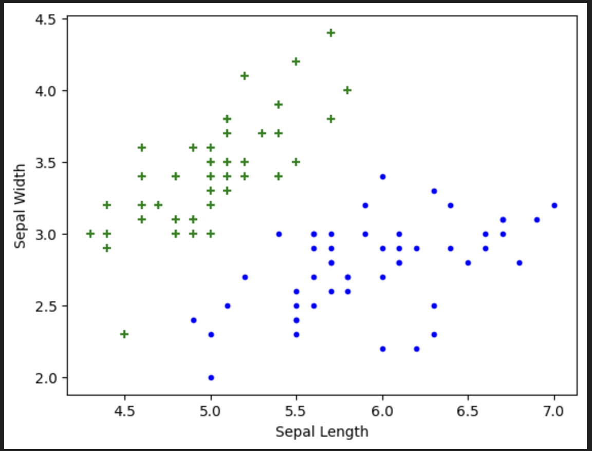
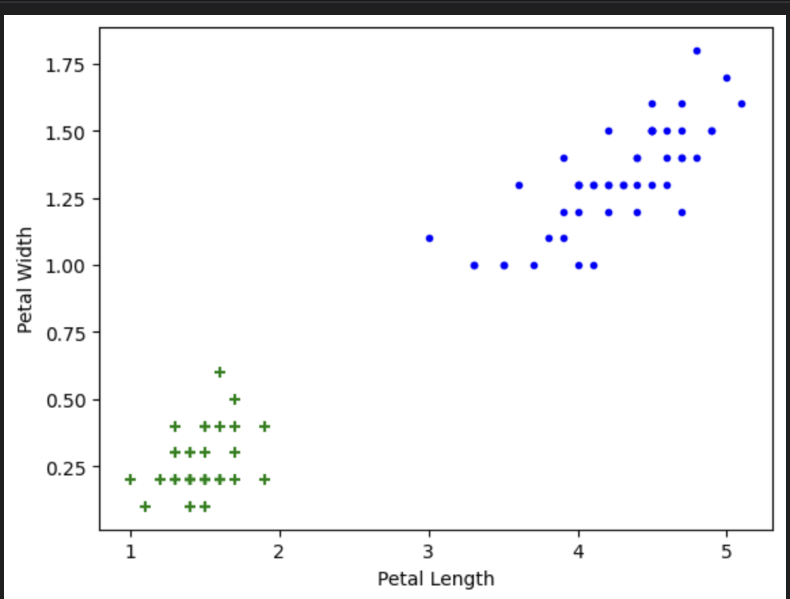
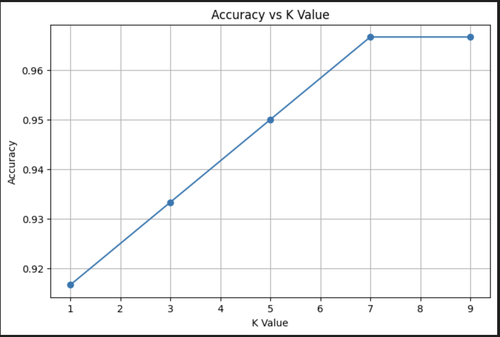

# 🌸 Iris Flower Classification using K-Nearest Neighbors (KNN)


---

# 📖 Project Overview

This project implements the **K-Nearest Neighbors (KNN)** algorithm to classify Iris flowers into three species using measurements of their sepals and petals.

The project demonstrates a complete machine learning classification workflow, including data visualization, model training, prediction, and evaluation using different K values.

---

# 🎯 Problem Statement

The Iris flower dataset is one of the most widely used datasets for supervised machine learning.

The objective is to classify an Iris flower into one of three species based on its physical measurements.

The three species are:

- Iris Setosa
- Iris Versicolor
- Iris Virginica

---

# 📂 Dataset Information

This project uses the **built-in Iris dataset** provided by Scikit-learn.

```python
from sklearn.datasets import load_iris
```

Dataset Summary

| Feature | Description |
|----------|-------------|
| Sepal Length | Length of the sepal |
| Sepal Width | Width of the sepal |
| Petal Length | Length of the petal |
| Petal Width | Width of the petal |

Target Classes

- Setosa
- Versicolor
- Virginica

Total Samples: **150**

---

# 🛠 Technologies Used

| Category | Technology |
|----------|------------|
| Programming Language | Python |
| Machine Learning | Scikit-learn |
| Numerical Computing | NumPy |
| Visualization | Matplotlib |
| Development Environment | Jupyter Notebook |

---

# ⚙️ Machine Learning Workflow

```text
Load Iris Dataset
        │
        ▼
Data Exploration
        │
        ▼
Feature Selection
        │
        ▼
Train-Test Split
        │
        ▼
KNN Model Training
        │
        ▼
Prediction
        │
        ▼
Accuracy Evaluation
```

---

# 📊 Data Visualization

## 🌿 Sepal Feature Distribution

The scatter plot below shows the relationship between **Sepal Length** and **Sepal Width**.



---

## 🌸 Petal Feature Distribution

The scatter plot below shows **Petal Length** and **Petal Width**, where the flower species are more clearly separated.



---

# 📈 Model Performance

## Accuracy vs K Value

Different K values were evaluated to determine the optimal number of neighbors for the classifier.



---

# 💡 Key Insights

- Petal features provide better class separation than sepal features.
- KNN is simple yet highly effective for the Iris dataset.
- Choosing an appropriate value of **K** improves classification accuracy.
- The Iris dataset is well suited for demonstrating supervised learning techniques.

---

# 🛠 Skills Demonstrated

- Data Visualization
- Supervised Machine Learning
- Classification Algorithms
- K-Nearest Neighbors (KNN)
- Model Evaluation
- Feature Analysis
- Python Programming
- Scikit-learn

---

# 📁 Project Structure

```text
KNN-Iris-Classification/
│
├── KNN_Iris_Classification.ipynb
├── README.md
├── requirements.txt
│
├── images/
│     sepal_scatter_plot.png
│     petal_scatter_plot.png
│     accuracy_vs_k.png
│
├── data/
│
└── outputs/
```

---

# ▶️ Installation

Clone the repository

```bash
git clone https://github.com/nareandra/Machine-Learning-Projects.git
```

Navigate to the project

```bash
cd Machine-Learning-Projects/KNN-Iris-Classification
```

Install dependencies

```bash
pip install -r requirements.txt
```

Launch Jupyter Notebook

```bash
jupyter notebook KNN_Iris_Classification.ipynb
```

---

# 🚀 Future Improvements

- Add Confusion Matrix
- Add Classification Report
- Perform Cross-Validation
- Compare with Decision Tree and SVM classifiers
- Deploy the model using Streamlit

---

# 👩‍💻 Author

**Nareandra**

Graduate Student

**The University of Aizu**

Japan 🇯🇵

### Areas of Interest

- Machine Learning
- Artificial Intelligence
- Computer Vision
- ROS2
- V2X Communication
- Autonomous Driving

---

# 📜 License

This project is licensed under the MIT License.