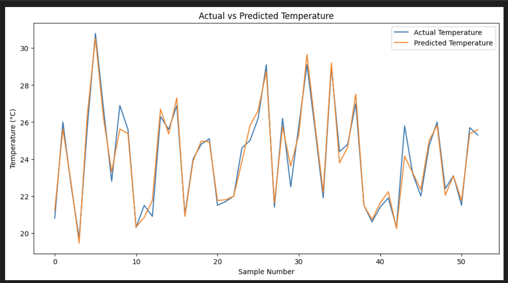
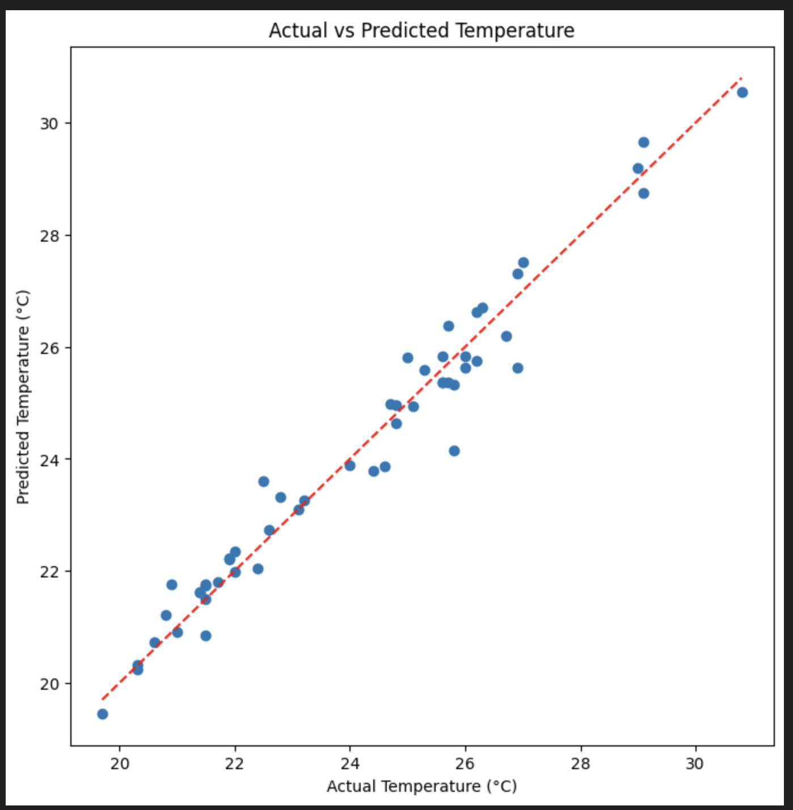

# 🌡️ Linear Regression Temperature Prediction

## 📖 Project Overview

This project demonstrates how a **Linear Regression** model can be used to predict temperature from historical data. The project covers the complete machine learning pipeline, including data preprocessing, visualization, model training, prediction, and evaluation.

---

## 🎯 Objectives

- Understand the Linear Regression algorithm
- Perform data preprocessing
- Train a regression model
- Predict temperature values
- Evaluate model performance
- Visualize the regression line

---

## 📂 Project Structure

```
Linear-Regression-Temperature-Prediction/
│
├── Linear_Regression_Temperature_Prediction.ipynb
├── README.md
├── requirements.txt
├── data/
│   └── data-2.csv
└── images/
    ├── regression_plot.png
    └── model_results.png
```

---

## 🛠 Technologies Used

- Python
- NumPy
- Pandas
- Matplotlib
- Scikit-learn
- Jupyter Notebook

---

## 🚀 How to Run

1. Clone the repository.
2. Install the required libraries.

```bash
pip install -r requirements.txt
```

3. Open the notebook.

```bash
jupyter notebook Linear_Regression_Temperature_Prediction.ipynb
```

---

## 📊 Results

### Regression Plot



### Model Performance



---

## 📈 Machine Learning Workflow

- Import libraries
- Load dataset
- Data preprocessing
- Data visualization
- Train-Test Split
- Linear Regression Model
- Model Prediction
- Performance Evaluation

---

## 🔮 Future Improvements

- Hyperparameter tuning
- Feature engineering
- Cross-validation
- Compare with Decision Tree Regression
- Compare with Random Forest Regression

---

## 👩‍💻 Author

**Nareandra**

Graduate Student – University of Aizu, Japan

**Interests**
- Machine Learning
- Artificial Intelligence
- Computer Vision
- ROS2
- V2X Communication
- Autonomous Driving