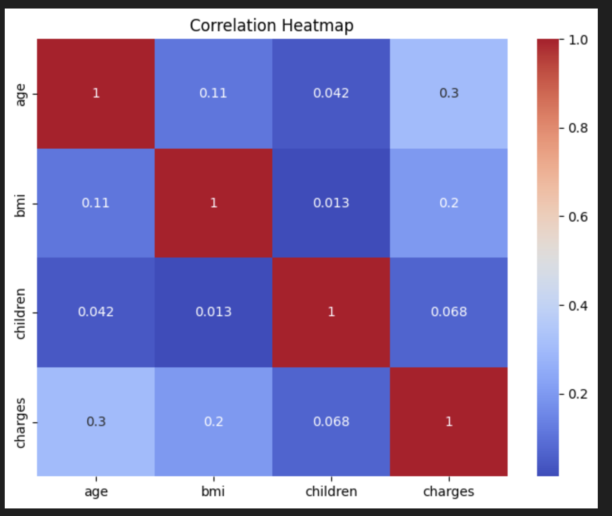

# 💰 Medical Cost Prediction using Machine Learning

## 📖 Project Overview

This project predicts **medical insurance charges** using Machine Learning. It demonstrates the complete machine learning workflow, including data preprocessing, exploratory data analysis (EDA), feature engineering, model training, prediction, and evaluation.

The project uses the **Medical Cost Personal Dataset** (`insurance.csv`) and applies regression techniques to estimate individual medical expenses based on demographic and health-related factors.

---

## 🎯 Objectives

- Analyze medical insurance data
- Perform data cleaning and preprocessing
- Explore relationships between different features
- Train a Machine Learning regression model
- Predict insurance charges
- Evaluate model performance using standard regression metrics

---

## 📂 Dataset

**Dataset:** `insurance.csv`

### Features

| Feature | Description |
|----------|-------------|
| age | Age of the insured person |
| sex | Gender |
| bmi | Body Mass Index |
| children | Number of dependent children |
| smoker | Smoking status |
| region | Residential region |
| charges | Medical insurance cost (Target Variable) |

---

## 📁 Project Structure

```text
Medical-Cost-Prediction/
│
├── Medical_Cost_Prediction.ipynb
├── README.md
├── requirements.txt
├── data/
│   └── insurance.csv
└── images/
    ├── dataset_preview.png
    ├── correlation_heatmap.png
    ├── prediction_plot.png
    └── model_results.png
```

---

## 🛠 Technologies Used

- Python
- NumPy
- Pandas
- Matplotlib
- Scikit-learn
- Jupyter Notebook

---

## ⚙️ Machine Learning Workflow

- Import required libraries
- Load the dataset
- Data preprocessing
- Exploratory Data Analysis (EDA)
- Encode categorical variables
- Feature selection
- Split dataset into training and testing sets
- Train the regression model
- Predict insurance charges
- Evaluate model performance

---

## 📊 Project Results

### Dataset Preview


---

### Correlation Heatmap



---

### Prediction Results


---

### Model Performance


---

## 📈 Evaluation Metrics

The model is evaluated using:

- Mean Absolute Error (MAE)
- Mean Squared Error (MSE)
- Root Mean Squared Error (RMSE)
- R² Score

---

## ▶️ Installation

Clone the repository

```bash
git clone https://github.com/your-username/Machine-Learning-Projects.git
```

Navigate to the project

```bash
cd Machine-Learning-Projects/Medical-Cost-Prediction
```

Install dependencies

```bash
pip install -r requirements.txt
```

Run the notebook

```bash
jupyter notebook Medical_Cost_Prediction.ipynb
```

---

## 📌 Future Improvements

- Hyperparameter tuning
- Feature engineering
- Cross-validation
- Compare multiple regression algorithms
- Deploy the model as a web application using Flask or Streamlit

---

## 💡 Skills Demonstrated

- Data Preprocessing
- Exploratory Data Analysis (EDA)
- Regression Analysis
- Feature Engineering
- Data Visualization
- Machine Learning Model Development
- Model Evaluation
- Python Programming

---

## 👩‍💻 Author

**Nareandra**

Graduate Student – University of Aizu, Japan

### Areas of Interest

- Machine Learning
- Artificial Intelligence
- Computer Vision
- ROS2
- V2X Communication
- Autonomous Driving

---

## 📜 License

This project is licensed under the MIT License.