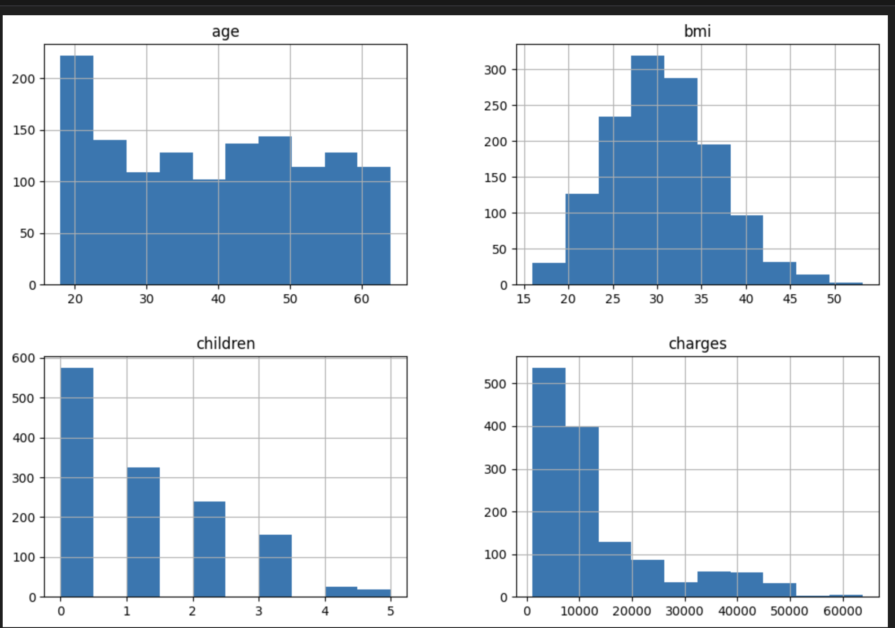
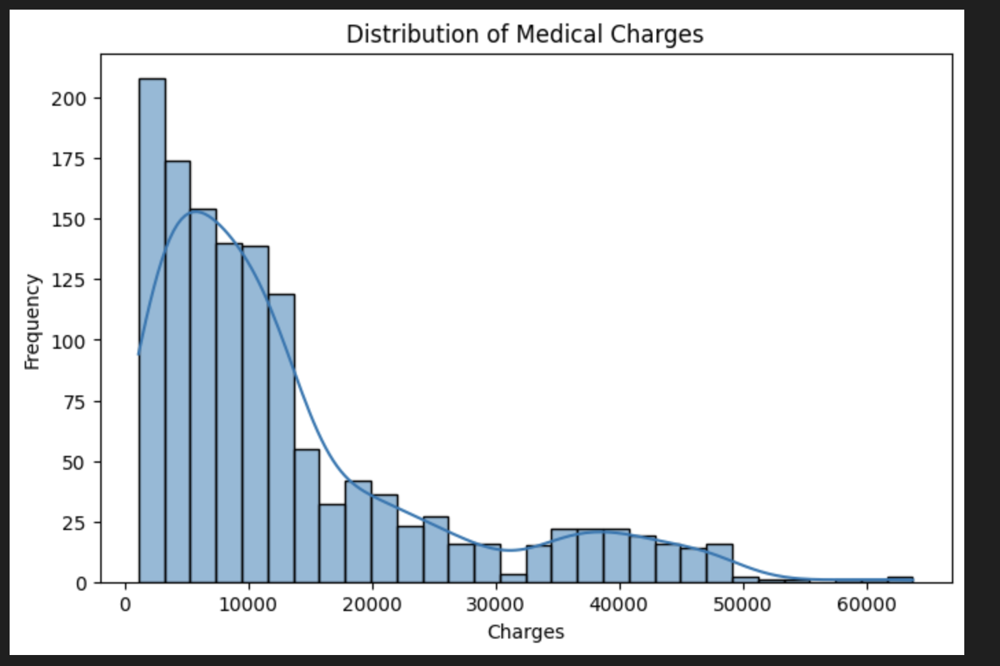
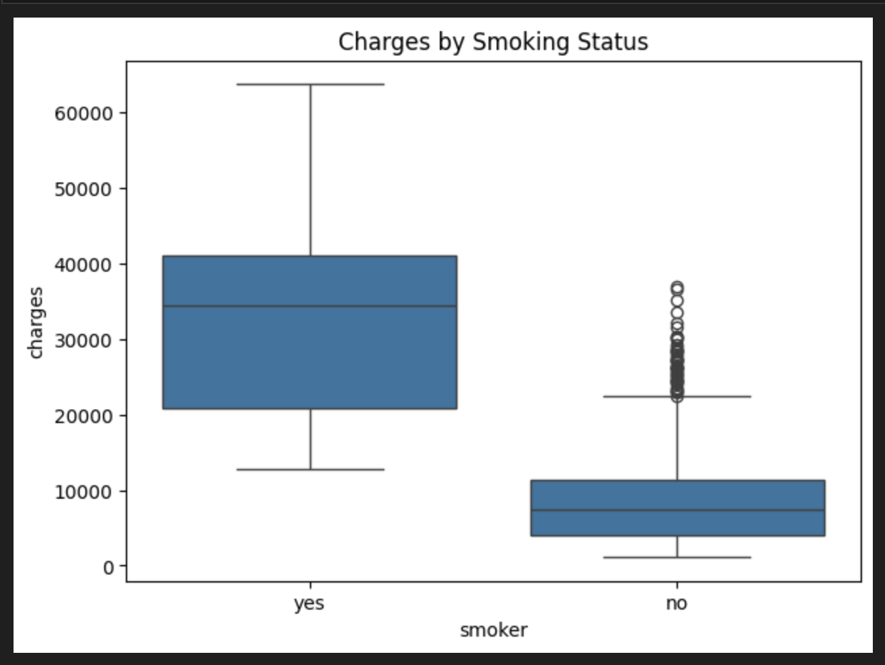
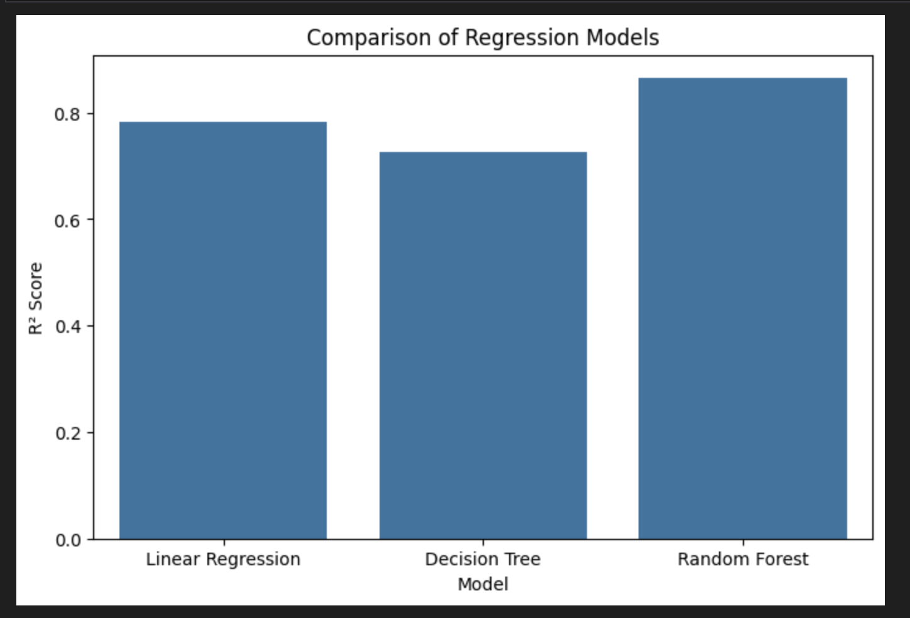
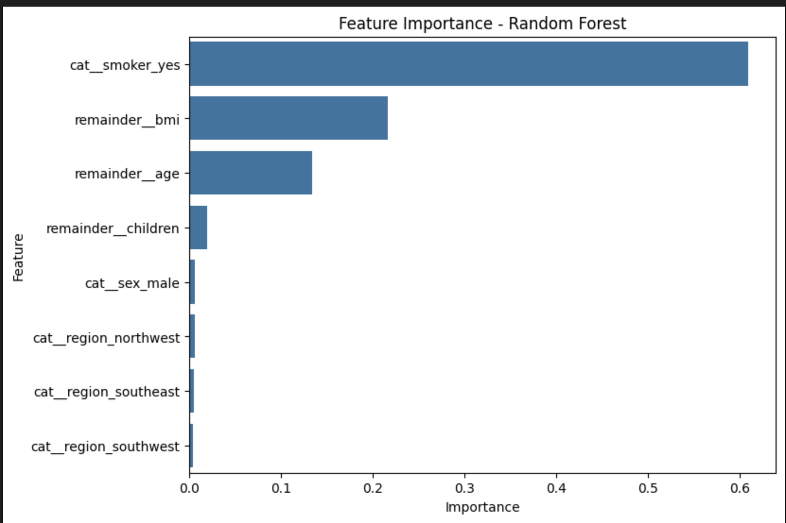

# 💰 Medical Cost Prediction using Machine Learning

## 📖 Project Overview

This project predicts **medical insurance charges** using Machine Learning techniques. It demonstrates the complete machine learning workflow, including data preprocessing, exploratory data analysis (EDA), feature engineering, model training, prediction, and model evaluation.

The project uses the **Medical Cost Personal Dataset** (`insurance.csv`) to estimate insurance charges based on demographic and health-related attributes such as age, BMI, smoking status, number of children, sex, and region.

---

## 🎯 Problem Statement

Medical insurance costs vary significantly among individuals due to factors such as age, body mass index (BMI), smoking habits, and lifestyle. Accurately predicting these costs can help insurance providers estimate premiums and assist individuals in better financial planning.

---

## 🎯 Objectives

- Perform data preprocessing and cleaning
- Conduct Exploratory Data Analysis (EDA)
- Analyze relationships between features
- Train multiple regression models
- Compare model performance
- Predict medical insurance charges
- Identify the most important features affecting medical costs

---

## 📂 Dataset Information

**Dataset:** Medical Cost Personal Dataset (`insurance.csv`)

| Feature | Description |
|----------|-------------|
| age | Age of the insured person |
| sex | Gender |
| bmi | Body Mass Index |
| children | Number of dependent children |
| smoker | Smoking status |
| region | Residential region |
| charges | Medical insurance charges (Target Variable) |

---

## 📁 Project Structure

```text
Medical-Cost-Prediction/
│
├── Medical_Cost_Prediction.ipynb
├── README.md
├── requirements.txt
├── data/
│   └── insurance.csv
└── images/
    ├── feature_distribution.png
    ├── charges_distribution.png
    ├── correlation_heatmap.png
    ├── smoking_vs_charges.png
    ├── model_comparison.png
    └── feature_importance.png
```

---

## 🛠 Technologies Used

| Category | Technologies |
|----------|--------------|
| Programming Language | Python |
| Data Analysis | Pandas, NumPy |
| Data Visualization | Matplotlib |
| Machine Learning | Scikit-learn |
| Development Environment | Jupyter Notebook |

---

## ⚙️ Machine Learning Workflow

```
Dataset
    ↓
Data Cleaning
    ↓
Exploratory Data Analysis (EDA)
    ↓
Feature Engineering
    ↓
Train-Test Split
    ↓
Model Training
    ↓
Prediction
    ↓
Performance Evaluation
```

---

# 📊 Exploratory Data Analysis

The exploratory data analysis (EDA) helps understand the distribution of features, identify relationships between variables, and discover patterns that influence medical insurance charges.

### 📈 Feature Distribution

The histograms below illustrate the distribution of important numerical variables such as **Age**, **BMI**, **Number of Children**, and **Medical Charges**.



---

### 💰 Distribution of Medical Charges

The target variable (**charges**) follows a positively skewed distribution, indicating that most individuals have relatively lower medical expenses while a smaller number incur significantly higher costs.



---

### 🔥 Correlation Heatmap

The heatmap visualizes the correlation between numerical variables, helping identify relationships with the target variable (**charges**).


---

### 🚬 Medical Charges by Smoking Status

The box plot demonstrates that smokers generally have much higher medical insurance charges compared to non-smokers.



---

# 📈 Model Performance

Three regression algorithms were trained and evaluated to identify the most suitable model for predicting medical insurance charges.

### Model Comparison



---

### Feature Importance (Random Forest)

Random Forest identifies **smoking status**, **BMI**, and **age** as the most influential features affecting insurance charges.



---

## 📊 Performance Comparison

| Model | R² Score | Performance |
|--------|---------:|-------------|
| Linear Regression | 0.79 | Good |
| Decision Tree Regression | 0.73 | Moderate |
| Random Forest Regression | 0.87 | Best |

> **Note:** Update these values if your notebook reports different R² scores.

---

## 💡 Key Insights

- Smoking status is the strongest predictor of medical insurance charges.
- BMI and age also have a significant impact on insurance costs.
- Medical charges exhibit a positively skewed distribution.
- Random Forest Regression achieved the highest prediction accuracy among the evaluated models.
- Proper preprocessing and feature engineering significantly improved model performance.

---

## 🛠 Skills Demonstrated

- Data Cleaning
- Exploratory Data Analysis (EDA)
- Feature Engineering
- Data Visualization
- Regression Analysis
- Model Evaluation
- Machine Learning using Scikit-learn
- Python Programming

---

## ▶️ Installation

Clone the repository:

```bash
git clone https://github.com/nareandra/Machine-Learning-Projects.git
```

Navigate to the project directory:

```bash
cd Machine-Learning-Projects/Medical-Cost-Prediction
```

Install the required libraries:

```bash
pip install -r requirements.txt
```

Launch Jupyter Notebook:

```bash
jupyter notebook Medical_Cost_Prediction.ipynb
```

---

## 🚀 Future Improvements

- Hyperparameter tuning using GridSearchCV
- Cross-validation for robust evaluation
- Experiment with XGBoost and Gradient Boosting models
- Deploy the model using Streamlit or Flask
- Build an interactive web application for insurance cost prediction

---

## 👩‍💻 Author

**Nareandra**

Graduate Student  
**The University of Aizu, Japan**

### Areas of Interest

- 🤖 Machine Learning
- 🧠 Artificial Intelligence
- 👁️ Computer Vision
- 🚗 Autonomous Driving
- 📡 V2X Communication
- 🤖 ROS2

---

## 📜 License

This project is licensed under the MIT License.